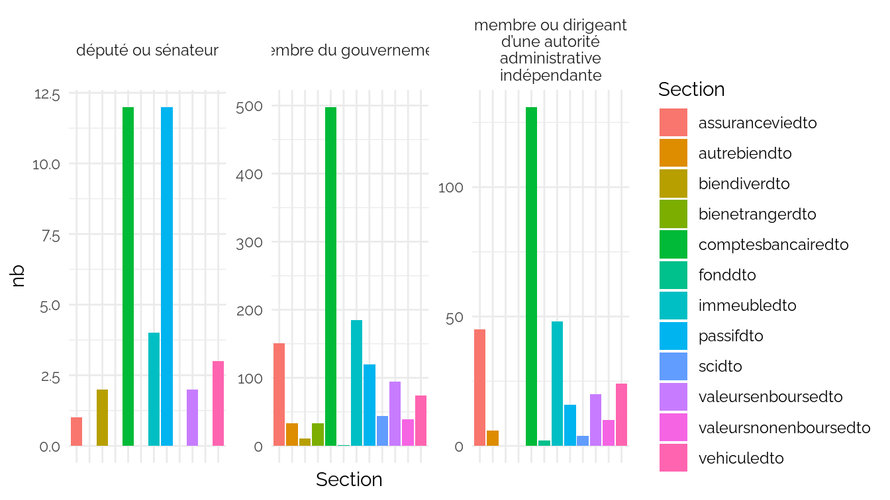
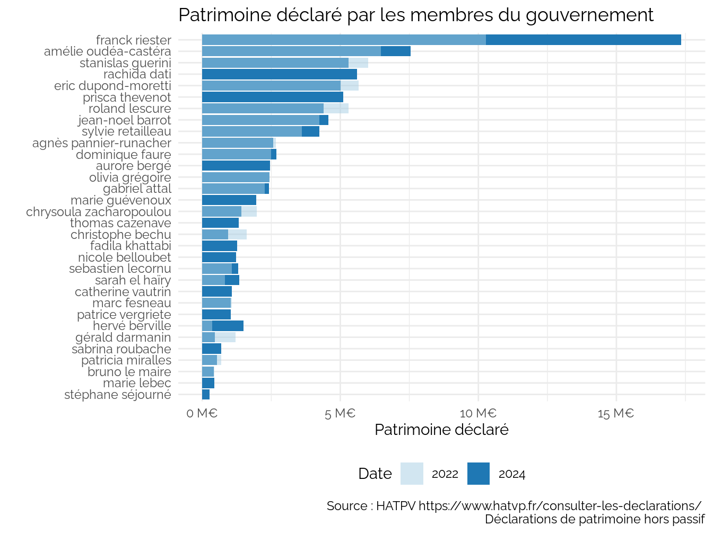
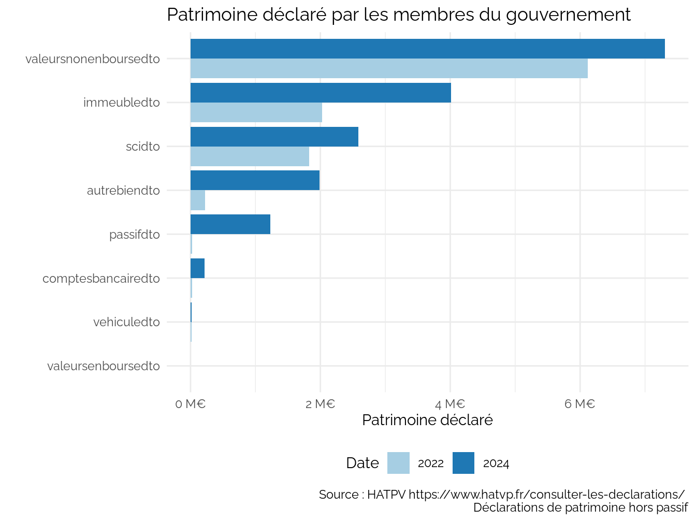
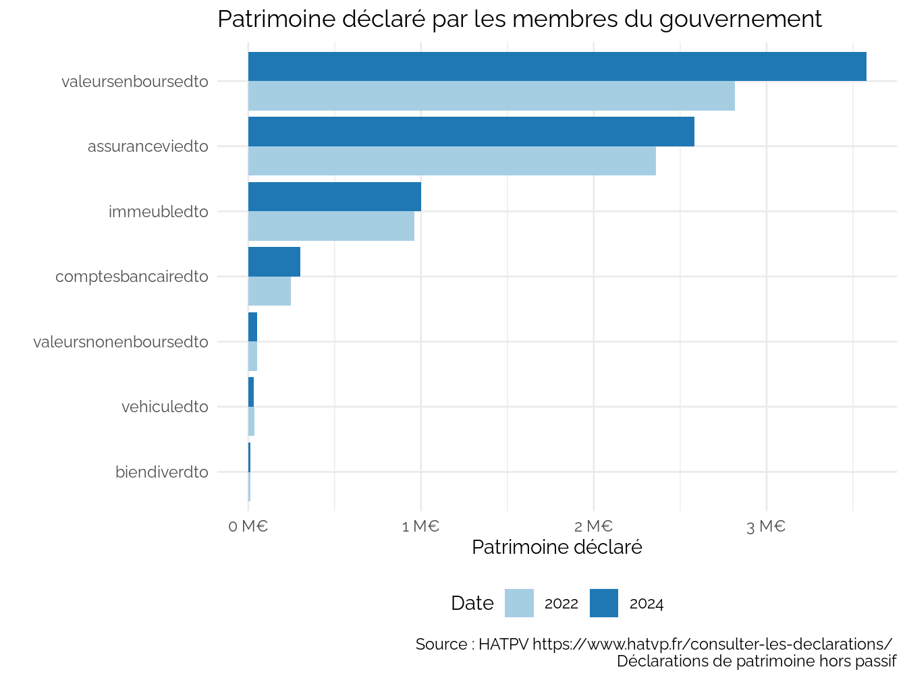

CPESR
================
CPESR
2024-07-14

## Données

- <https://www.hatvp.fr/open-data/>

<!-- -->

    ## Joining with `by = join_by(Nom, Prénom, Date_depot)`

## Explorations

Section

| Section            |  nb |
|:-------------------|----:|
| immeubledto        | 237 |
| valeursenboursedto | 116 |
| assuranceviedto    | 197 |
| comptesbancairedto | 641 |
| scidto             |  48 |
| biendiverdto       |  13 |

Type_mandat

| Type_mandat                                                    |   nb |
|:---------------------------------------------------------------|-----:|
| membre du gouvernement                                         | 1283 |
| membre ou dirigeant d’une autorité administrative indépendante |  306 |
| député ou sénateur                                             |   36 |

Voir les données

| Description | Nb_parts | Valeur |
|:------------|---------:|-------:|

## Personnes

    ## # A tibble: 23 × 5
    ## # Groups:   Type_mandat [3]
    ##    Nom            Prénom    Type_mandat            Mandat                 Valeur
    ##    <chr>          <chr>     <chr>                  <chr>                   <int>
    ##  1 valletoux      frederic  député ou sénateur     ""                     9.36e5
    ##  2 ferrari        marina    député ou sénateur     ""                     5.24e5
    ##  3 kasbarian      guillaume député ou sénateur     ""                     4.07e5
    ##  4 riester        franck    membre du gouvernement "ministre délégué cha… 1.73e7
    ##  5 oudéa-castéra  amélie    membre du gouvernement "ministre de l'éducat… 7.55e6
    ##  6 penicaud       muriel    membre du gouvernement "ministre du travail"  7.54e6
    ##  7 hulot          nicolas   membre du gouvernement "ministre de la trans… 7.52e6
    ##  8 firmin le bodo agnès     membre du gouvernement "ministre déléguée au… 6.19e6
    ##  9 dati           rachida   membre du gouvernement "ministre de la cultu… 5.61e6
    ## 10 guerini        stanislas membre du gouvernement "ministre de la trans… 5.31e6
    ## # ℹ 13 more rows

## Gouv

    ## Joining with `by = join_by(Nom, Prénom)`

Voir les données

|     Prénom |              Nom | Patrimoine 2024 | Patrimoine 2022 |
|-----------:|-----------------:|----------------:|----------------:|
|     franck |          riester |      17 349 701 |      10 265 747 |
|     amélie |    oudéa-castéra |       7 553 492 |       6 476 876 |
|    rachida |             dati |       5 609 467 |              NA |
|  stanislas |          guerini |       5 306 511 |       6 013 971 |
|     prisca |         thevenot |       5 098 573 |              NA |
|       eric |   dupond-moretti |       5 016 181 |       5 671 894 |
|  jean-noel |           barrot |       4 567 141 |       4 247 663 |
|     roland |          lescure |       4 392 153 |       5 291 803 |
|     sylvie |       retailleau |       4 247 796 |       3 610 288 |
|  dominique |            faure |       2 693 914 |       2 484 136 |
|      agnès | pannier-runacher |       2 575 173 |       2 675 267 |
|     aurore |            bergé |       2 451 555 |              NA |
|     olivia |         grégoire |       2 435 339 |       2 430 240 |
|    gabriel |            attal |       2 408 251 |       2 264 761 |
|      marie |        guévenoux |       1 962 284 |              NA |
|      hervé |         berville |       1 491 422 |         356 287 |
|  chrysoula |    zacharopoulou |       1 415 961 |       1 976 070 |
|      sarah |         el haïry |       1 340 077 |         820 532 |
|     thomas |         cazenave |       1 330 139 |              NA |
|  sebastien |          lecornu |       1 301 053 |       1 069 985 |
|     fadila |         khattabi |       1 254 561 |              NA |
|     nicole |        belloubet |       1 229 705 |              NA |
|  catherine |          vautrin |       1 070 661 |              NA |
|    patrice |        vergriete |       1 042 188 |              NA |
|       marc |          fesneau |       1 034 856 |       1 079 078 |
| christophe |            bechu |         946 665 |       1 618 048 |
|    sabrina |         roubache |         692 714 |              NA |
|   patricia |         miralles |         540 667 |         691 965 |
|     gérald |         darmanin |         457 302 |       1 215 098 |
|      marie |            lebec |         434 961 |              NA |
|      bruno |         le maire |         427 259 |         444 958 |
|   stéphane |         séjourné |         259 632 |              NA |

